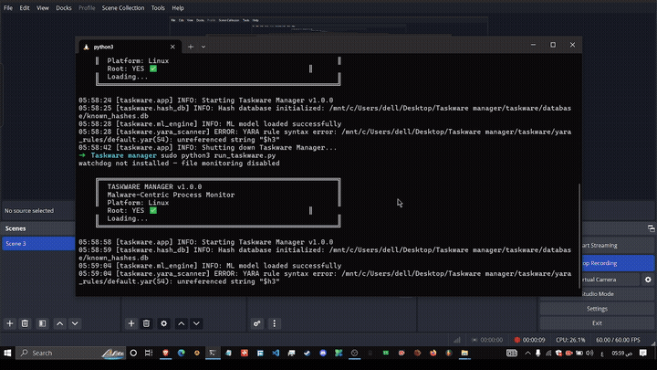

# Taskware Manager

**Malware-Centric Process Monitor for Linux**
100% Offline, Live Malware Analysis & Threat Hunting




Taskware Manager is an advanced, offline process monitoring and malware analysis tool designed exclusively for Linux systems. It leverages a combination of YARA rules, machine-learning-based system call analysis (via `strace`), and heuristic behavioral monitoring to identify potential threats, abnormal activities, and malware execution in real-time.

---

## Features

- **Live Process Monitoring**: Monitor running processes, track child-parent relationships, and detect suspicious process structures.
- **YARA Integration**: Built-in YARA scanning to match process memory and disk files against known malware signatures.
- **Machine Learning Syscall Analysis**: Uses `strace` to intercept and analyze process system calls, identifying malicious patterns through trained ML models.
- **Heuristic Engine**: Detects abnormal command-line executions, unauthorized persistence mechanisms, and advanced evasion techniques.
- **Memory Dumping**: Allows analysts to dump process memory for offline analysis (requires root).
- **Offline First**: All scanning, heuristics, and ML analysis run strictly offline to ensure operational security.
- **GUI Dashboard**: PyQt6-based graphical interface for ease of use, enabling quick threat triage and process termination.

---

## Prerequisites

Taskware Manager requires a Linux environment. Some core features (like memory dumping and `strace` analysis) necessitate root privileges.

### System Packages
```bash
sudo apt update
sudo apt install strace python3 python3-pip
```

### Python Dependencies
```bash
pip install -r requirements.txt
```

---

## Usage

### Standard Mode (Limited Access)
Run the application as a standard user. Note that memory dumping and system-call analysis will be restricted.
```bash
python3 run_taskware.py
```

### Advanced Mode (Root - Recommended)
Run the application with root privileges to enable full capabilities, including `/proc/pid/mem` access and comprehensive `strace` attachment.
```bash
sudo python3 run_taskware.py
```

---

## Documentation

For complete details on configuring, using, and extending Taskware Manager, please refer to the files in the `docs/` directory:

- [Setup & Installation](docs/setup.md)
- [Architecture Overview](docs/architecture.md)
- [Detection Engine & YARA](docs/detection.md)
- [Machine Learning Module](docs/ml_analysis.md)
- [Troubleshooting](docs/troubleshooting.md)


